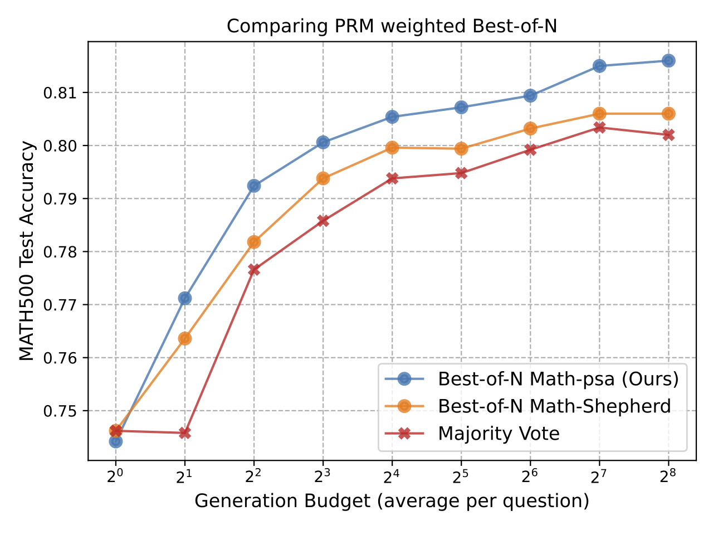
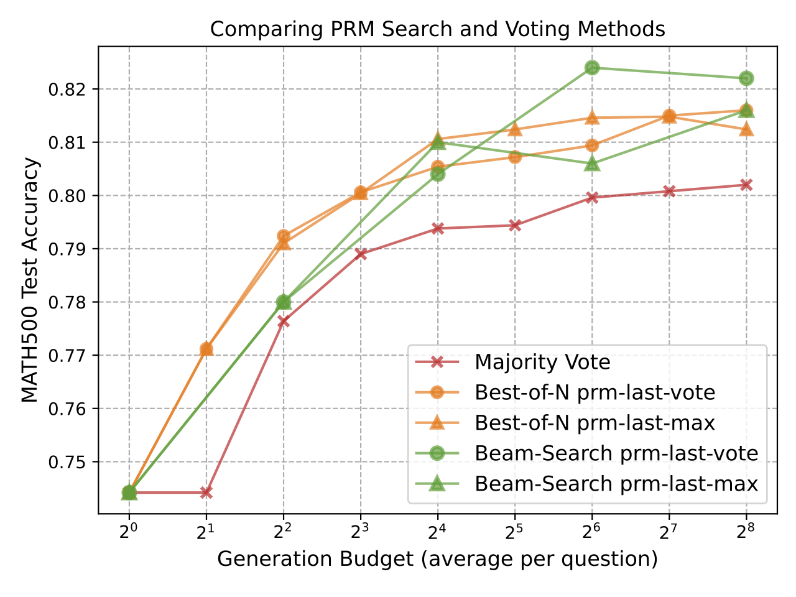
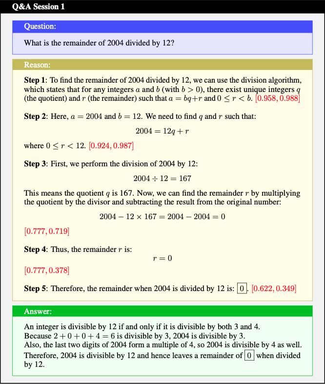
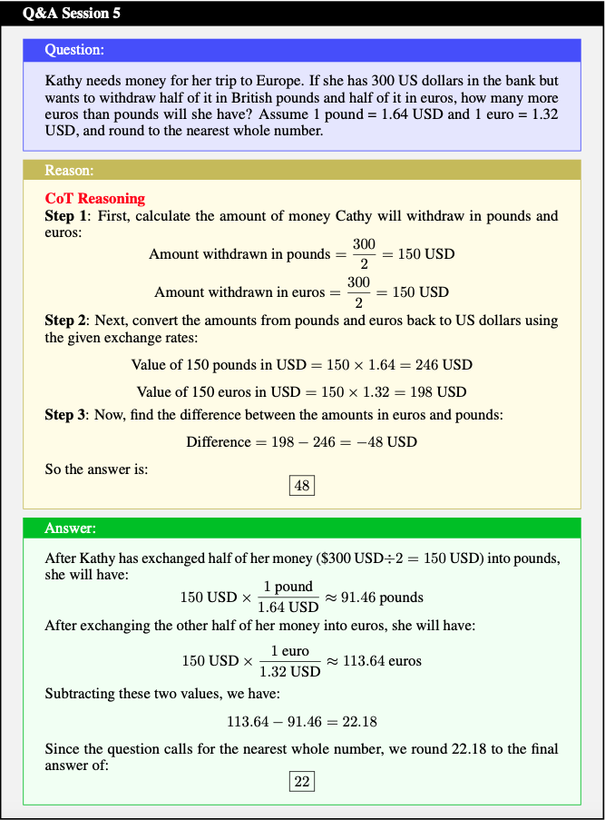
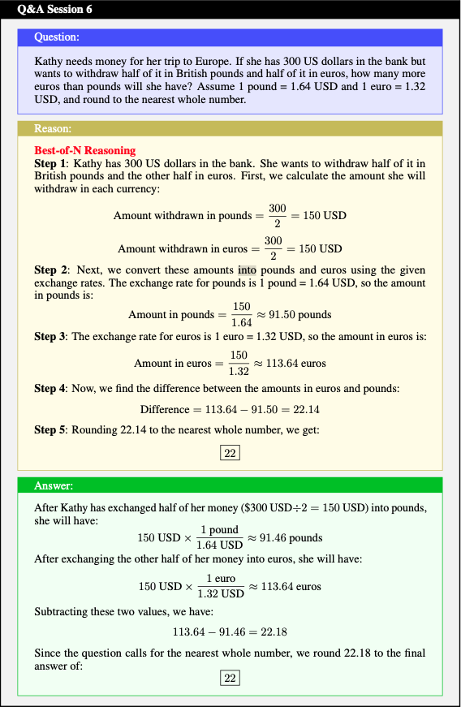
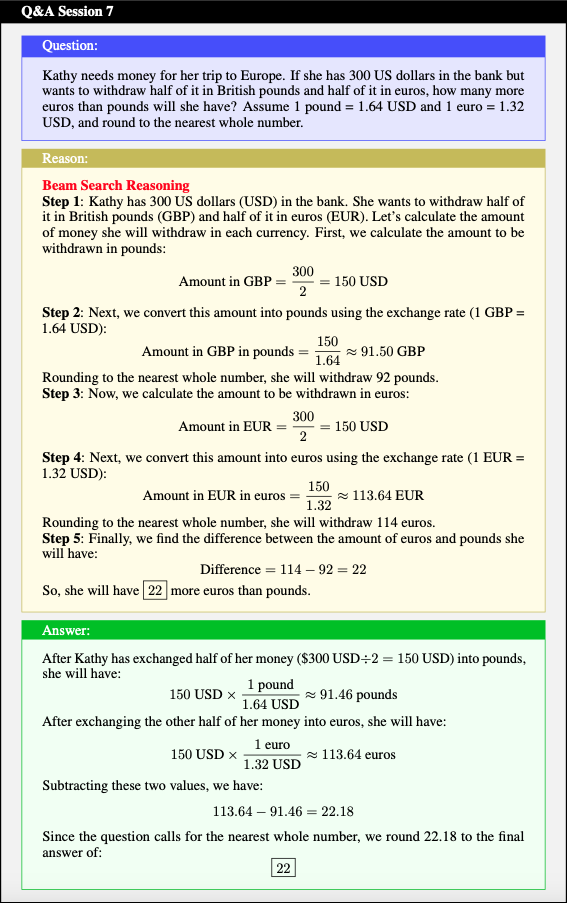

<div id="top"></div>
<!--
*** Thanks for checking out the Best-README-Template. If you have a suggestion
*** that would make this better, please fork the repo and create a pull request
*** or simply open an issue with the tag "enhancement".
*** Don't forget to give the project a star!
*** Thanks again! Now go create something AMAZING! :D
-->

<!-- PROJECT SHIELDS -->

<!--
*** I'm using markdown "reference style" links for readability.
*** Reference links are enclosed in brackets [ ] instead of parentheses ( ).
*** See the bottom of this document for the declaration of the reference variables
*** for contributors-url, forks-url, etc. This is an optional, concise syntax you may use.
*** https://www.markdownguide.org/basic-syntax/#reference-style-links
-->

<!-- 
***[![MIT License][license-shield]][license-url]
-->

<!-- PROJECT LOGO -->

<br />
<div align="center">
  <a href="https://github.com/openreasoner/openr/">
    
  </a>

<!-- <h2 align="center">OpenR</h2> -->

<p align="center">
    <span style="font-size: 30px;"><strong><em>OpenR</em></strong>: An Open-Sourced Framework for Advanced Reasoning with Large Language Models </span>
    <!-- <br />
    <a href="https://openreasoner.github.io/"><strong>Explore the docs »</strong></a>
    <br /> -->
    <br />
    <a href="https://github.com/openreasoner/openr/blob/main/reports/OpenR-Wang.pdf">Paper</a>
    ·
    <a href="https://github.com/openreasoner/openr/blob/main/reports/Tutorial-LLM-Reasoning-Wang.pdf">Tutorial</a>
    ·
    <a href="https://github.com/openreasoner/openr">Code</a>
    ·
    <a href="https://openreasoner.github.io/">Docs</a>
    ·
    <a href="https://huggingface.co/datasets/openreasoner/MATH-APS">Data</a>
    ·
    <a href="https://huggingface.co/openreasoner/Math-psa">Model</a>
    ·
    <a href="https://github.com/openreasoner/openr/issues">Issue</a>
<!--     · -->
<!--     <a href="https://medium.com/p/xxxxxx">Blog (Pytorch)</a> -->
  </p>
</div>

---
[![Contributors][contributors-shield]][contributors-url]
[![Forks][forks-shield]][forks-url]
[![Stargazers][stars-shield]][stars-url]
[![Issues][issues-shield]][issues-url]

<!-- TABLE OF CONTENTS -->

[//]: # (<details>)
  <summary>Table of Contents</summary>
  <ol>
    <li><a href="#news-and-updates">News and Updates</a></li>
    <li><a href="#features">Features</a></li>
    <li><a href="#plots">Plots</a></li>
    <li><a href="#provided-datasets-and-models">Datasets and Models</a></li>
    <li>
      <a href="#getting-started">Getting Started</a>
      <ul>
        <li><a href="#installation">Installation</a></li>
        <li><a href="#quickstart">Quick Start</a></li>
      </ul>
    </li>
    <li><a href="#usage">Usage</a></li>
    <li><a href="#contact">Contact</a></li>
    <li><a href="#license">License</a></li>
    <li><a href="#response-examples">Response Examples</a></li>
    <li><a href="#reference">Reference</a></li>
  </ol>

[//]: # (</details>)

<!-- News and Updates -->

## News and Updates
- 
- [12/10/2024] OpenR has been released! 🚀 
  
## Features
<ul style="list-style-type: none; padding: 0;">
    <li><strong>✅ Process-supervision Data Release</strong></li>
    <li><strong>✅ Online RL Training</strong></li>
    <li><strong>✅ Generative and Discriminative PRM Training</strong></li>
    <li><strong>✅ Multiple Search Strategies</strong></li>
    <li><strong>✅ Test-time Computation</strong></li>
    <li><strong>✅ Test-time Scaling Law</strong></li>
</ul>

## Plots

<p align="center">
  
  
</p>

## Provided Datasets and Models

[//]: # ([PRM800K]&#40;https://github.com/openai/prm800k&#41; &#40;Process Supervision Dataset&#41;)

[MATH-APS](https://huggingface.co/datasets/mengfang/MATH-APS) (Our Dataset)

[MATH-psa](https://huggingface.co/openreasoner/Math-psa) (Our Process Reward Model)

## Getting Started


### Installation

```
conda create -n open_reasoner python=3.10
conda activate open_reasoner
pip install -r requirements.txt
pip3 install  "fschat[model_worker,webui]"
pip install -U pydantic
cd envs/MATH/latex2sympy
pip install -e .
cd -
```


### Download Base Models


Before running the project, please ensure that all required base models are downloaded. The models used in this project include:

- `Qwen2.5-Math-1.5B-Instruct`, `Qwen2.5-Math-7B-Instruct`
- `Qwen2.5-Math-RM-72B`
- `peiyi9979/mistral-7b-sft`
- `peiyi9979/math-shepherd-mistral-7b-prm`

To download these models, please refer to the [Hugging Face model downloading tutorial](https://huggingface.co/docs/hub/models-downloading) for step-by-step guidance on downloading models from the Hugging Face Hub.

Ensure that all models are saved in their directories according to the project setup before proceeding.


### Quickstart

Before running inference, please modify the following variables in the `reason/llm_service/create_service_math_shepherd.sh` script to set the appropriate base models for your usage:

- `$MODEL_BASE`: Set this to the directory where your models are stored.
- `$POLICY_MODEL_NAME`: Set this to the name of the policy model you wish to use.
- `$VALUE_MODEL_NAME`: Set this to the name of the value model you wish to use.
- `$NUM_LM_WORKER`: Set this to the number of language model (LM) workers to start.
- `$NUM_RM_WORKER`: Set this to the number of reward model (RM) workers to start.

Then it prepares and runs inference using different techniques.

#### Start LM & RM Services
```bash
sh reason/llm_service/create_service_math_shepherd.sh
```

## Usage

#### Run Inference
```bash
export PYTHONPATH=$(pwd)
sh scripts/eval/cot_greedy.sh
sh scripts/eval/cot_rerank.sh
sh scripts/eval/beam_search.sh
```

#### Run Training

Before training, please modify the `$dataset_path`, `$model_name_or_path` and `$prm_name_or_path` in `train/mat/scripts/train_llm.sh`.

```bash
cd train/mat/scripts
bash train_llm.sh
```

#### Run PRM Learning

```bash
cd prm/code

\\ single gpu
python finetune_qwen.py --total_batch_size 256 \
                          --learning_rate 1e-4 \
                          --datasets all \

\\ multi gpu
torchrun --nproc_per_node = 2 finetune_qwen.py --total_batch_size 256 \
                                                --learning_rate 1e-4 \
                                                --datasets all \
```

## Future Plan

- Add More Comprehensive Evaluations on RL Training and Search Strategies

- Scaling the Prove-Verifier Model Size

- Support Self-improvement Training

<!-- CONTACT -->

## Contact

The OpenR community is maintained by:

- Jun Wang (jun.wang@cs.ucl.ac.uk) University College London

## License
OpenR is released under the MIT License.

## Citation

If you do find our resources helpful, please cite our paper:

```
@article{openr2024,
  title = {OpenR: An Open Source Framework for Advanced Reasoning with Large Language Models},
  url = {https://github.com/openreasoner/openr/blob/main/reports/OpenR-Wang.pdf},
  author = {Jun Wang, Meng Fang, Ziyu Wan, Muning Wen, Jiachen Zhu, Anjie Liu, 
              Ziqin Gong, Yan Song, Lei Chen, Lionel M. Ni, Linyi Yang, Ying Wen, Weinan Zhang},
  year = {2024}
}
```

## Response Examples

### Comparing PRM, Math-psa (Ours) V.S. Math-Shepherd 

<p align="center">
  
  
</p>


### Justifing RL Training

<p align="center">
  
  
</p>

### Exploring Test-time Computation

<p align="center">
  
  
  
</p>


## Reference

### Inference-time Computing
[1] [Alphazero-like tree-search can guide large language model decoding and training.](https://arxiv.org/pdf/2309.17179)

[2] [Reasoning with language model is planning with world model.](https://arxiv.org/pdf/2305.14992)

[3] [Scaling LLM test-time compute optimally can be more effective than scaling model parameters](https://arxiv.org/pdf/2408.03314?)

[4] [Think before you speak: Training language models with pause tokens](https://arxiv.org/pdf/2310.02226)


### From Outcome Supervision to Process Supervision

[1] [Training verifiers to solve math word problems](https://arxiv.org/pdf/2110.14168)

[2] [Solving math word problems with process-and outcome-based feedback](https://arxiv.org/pdf/2211.14275)

[3] [Let’s verify step by step](https://arxiv.org/pdf/2305.20050)

[4] [Making large language models better reasoners with step-aware verifier](https://arxiv.org/pdf/2206.02336)

[5] [Ovm, outcome-supervised value models for planning in
mathematical reasoning](https://aclanthology.org/2024.findings-naacl.55.pdf)

[6] [Generative verifiers: Reward modeling as next-token prediction](https://arxiv.org/pdf/2408.15240)

### Data Acquisition

[1] [Star: Bootstrapping reasoning with reasoning](https://proceedings.neurips.cc/paper_files/paper/2022/file/639a9a172c044fbb64175b5fad42e9a5-Paper-Conference.pdf)

[2] [Quiet-star: Language models can teach themselves to think before speaking](https://arxiv.org/pdf/2403.09629)

[3] [Improve mathematical reasoning in language models by automated
process supervision](https://arxiv.org/pdf/2406.06592)

[4] [Shepherd: A critic for language model generation](https://arxiv.org/abs/2308.04592)

[5] [Math-shepherd: Verify and reinforce llms step-by-step without human annotations](https://aclanthology.org/2024.acl-long.510.pdf)

<!-- MARKDOWN LINKS & IMAGES -->

<!-- https://www.markdownguide.org/basic-syntax/#reference-style-links -->

[contributors-shield]: https://img.shields.io/github/contributors/openreasoner/openr.svg?style=for-the-badge
[contributors-url]: https://github.com/openreasoner/openr/graphs/contributors
[forks-shield]: https://img.shields.io/github/forks/openreasoner/openr.svg?style=for-the-badge
[forks-url]: https://github.com/openreasoner/openr/network/members
[stars-shield]: https://img.shields.io/github/stars/openreasoner/openr.svg?style=for-the-badge
[stars-url]: https://github.com/openreasoner/openr/stargazers
[issues-shield]: https://img.shields.io/github/issues/openreasoner/openr.svg?style=for-the-badge
[issues-url]: https://github.com/openreasoner/openr/issues

[license-shield]: https://img.shields.io/github/license/openreasoner/openr.svg?style=for-the-badge
[license-url]: https://github.com/openreasoner/openr/blob/main/LICENSE.txt
