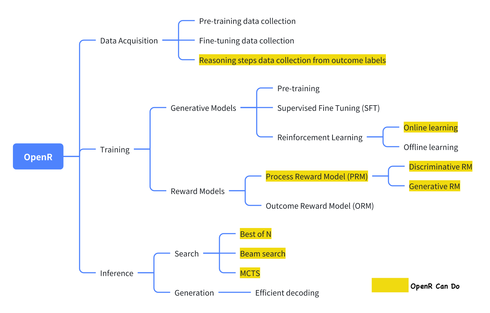

# OpenR
{: .no_toc }


An Open Source Framework for Advancing
Reasoning in LLMs
{: .fs-6 .fw-300 }

[![Contributors][contributors-shield]][contributors-url]
[![Forks][forks-shield]][forks-url]
[![Stargazers][stars-shield]][stars-url]
[![Issues][issues-shield]][issues-url]

<p align='center'>

<p align="center">
    <a href="https://arxiv.org/abs/xxxxx">Paper</a>
    ·
    <!-- <a href="https://colab.research.google.com/XXXXX">Demo</a> -->
    <!-- · -->
    <a href="https://iamlilaj.github.io/OpenR-docs/">Docs</a>
    ·
    <a href="https://github.com/openreasoner/o1-dev/issues">Issue</a>
    <!-- · -->
    <!-- <a href="https://medium.com/p/xxxxxx">Blog (Pytorch)</a> -->
    <!-- · -->
    <!-- <a href="https://nips.cc/virtual/xxxxx">Video</a> -->
  </p>
</p>

<p align="center">
    <a href="./docs/get-start.html" class="btn btn-primary fs-5 mb-4 mb-md-0 mr-2">Get started now</a>
    <a href="https://github.com/openreasoner/o1-dev" class="btn fs-5 mb-4 mb-md-0">View it on GitHub</a>
</p>

## Table of contents
{: .no_toc .text-delta }

1. TOC
{:toc}

---


## 🚀 News and Updates

<span style="color: #555; font-weight: bold;">[11/10/2024]</span> <span style="color: #007acc;">OpenR has been released!</span>


## Key Features

<!-- <ul style="list-style-type: none; padding: 0;">
    <li><strong>✅ Test-time Computation</strong></li>
    <li><strong>✅ Test-time Scaling Law</strong></li>
    <li><strong>✅ Process-supervision Data Release</strong></li>
    <li><strong>✅ Support Online RL Training</strong></li>
    <li><strong>✅ Support both Generative and Discriminative PRM Training</strong></li>
    <li><strong>✅ Support Multiple Search Strategies</strong></li>
</ul> -->

<div style="display: flex; align-items: center;">
<ul style="list-style-type: none; padding: 0;">
    <li><strong>✅ Test-time Computation</strong></li>
    <li><strong>✅ Test-time Scaling Law</strong></li>
    <li><strong>✅ Process-supervision Data Release</strong></li>
    <li><strong>✅ Online RL Training</strong></li>
    <li><strong>✅ Generative and Discriminative PRM Training</strong></li>
    <li><strong>✅ Multiple Search Strategies</strong></li>
</ul>
    
</div>

## What is OpenR?

> **OpenR** is an open-source framework that integrates **search**, **reinforcement learning** and **process supervision** to improve **reasoning** in Large Language Models.


OpenAI o1 has demonstrated that leveraging reinforcement learning to inherently
integrate reasoning steps during inference can greatly improve a model’s reasoning abilities. 

We attribute these enhanced reasoning capabilities to the integration of **search**, **reinforcement learning**, and **process supervision**, which collectively drive the development of **OpenR**.


Our work is the first to provide an open-source framework demonstrating how the effective utilization of these techniques enables LLMs to achieve advanced reasoning capabilities, 


## What Can OpenR Do?

> We believe the ability of reasoning can be improved by the following:



<!-- OpenReasoner is an open-source framework designed to enhance reasoning capabilities in Large Language Models (LLMs) by focusing on three key pathways: -->

- **Data Acquisition**: This pathway emphasizes the critical role of high-quality, diverse datasets in training LLMs. It includes data collection for both model pre-training and fine-tuning, with a specific focus on **reasoning** process, which are central to OpenResoner's objectives. Given the significant costs associated with human annotation of reasoning data, **we offer an automated pipeline that extracts reasoning steps from outcome labels**, reducing manual effort while ensuring the collection of valuable reasoning information.

- **Training**: This pathway centers around training strategies that enhance the reasoning capabilities of LLMs, from the perspective of both generative models and reward models. OpenR provide toolkits such as **online reinforcement learning** to train LLMs as the proposer, and methods to learn **Process-supervision Reward Models** (PRMs) as the verifier.

- **Inference**: This pathway focuses on the scaling law at test-time, enabling LLM to give refined outputs through ways of generation or searching. OpenR allows us to **select among various search algorithms**—such as *beam search*, *best-of-N selection*, and others—each with unique advantages depending on the quality of the process reward models.


## How to OpenR?

> Simply follow our [guides](./docs/get-start/index.html)!!

To any interested in making **OpenR** better, there are still improvements that need to be done. A full TODO list will be available soon.


## Citing OpenR

To cite this project in publications:

```text
@
```


<!-- MARKDOWN LINKS & IMAGES -->

<!-- https://www.markdownguide.org/basic-syntax/#reference-style-links -->

[contributors-shield]: https://img.shields.io/github/contributors/openreasoner/o1-dev.svg?style=for-the-badge
[contributors-url]: https://github.com/openreasoner/o1-dev/graphs/contributors
[forks-shield]: https://img.shields.io/github/forks/openreasoner/o1-dev.svg?style=for-the-badge
[forks-url]: https://github.com/openreasoner/o1-dev/network/members
[stars-shield]: https://img.shields.io/github/stars/openreasoner/o1-dev.svg?style=for-the-badge
[stars-url]: https://github.com/openreasoner/o1-dev/stargazers
[issues-shield]: https://img.shields.io/github/issues/openreasoner/o1-dev.svg?style=for-the-badge
[issues-url]: https://github.com/openreasoner/o1-dev/issues

[license-shield]: https://img.shields.io/github/license/openreasoner/o1-dev.svg?style=for-the-badge
[license-url]: https://github.com/openreasoner/o1-dev/blob/main/LICENSE.txt